# How to develop a REST API which integrates with a SOAP backend
May be it is yet another tutorial on IIB, but I found the product documentation a little bit unclear, and some existing videos / tutorial being too light or start with some pre-requisite already done. So we will try to explain how to really do a REST api that exposes RESTful APIs and map each resource to an existing SOAP service operations. The source for the SOAP interface is defined in the [data access layer](https://github.com/ibm-cloud-architecture/refarch-integration-inventory-dal) project. This java application runs on liberty and is deployed on a VM server with IP address of 172.16.249.79. This application exposes CRUD operations for three entities: item, inventory and supplier. Imagine it was done ten years ago. Today, it will be split into two or even three microservices, one per entity. In fact the microservice granularity will depend of the business logic ownership. In this case we can imagine one group own the inventory management.

## Pre-requisites
You could use docker to run IIB runtime. For instruction on how we did build the mq, iib runtime image read [this note](../../docker/README.md).
You need IIB Toolkit on Windows to develop the IIB application by installing the developer edition.
Be sure to reuse the swagger file defining the REST api () and WSDL file defining the back end SOAP interface (https://github.com/ibm-cloud-architecture/refarch-integration-inventory-dal/blob/master/docs/ws.v2.wsdl).

## What we want to build and deploy
To make it simple in the context of this solution, we want to implement two flows that we deploy on two different IIB instances (item 2 in diagram below).

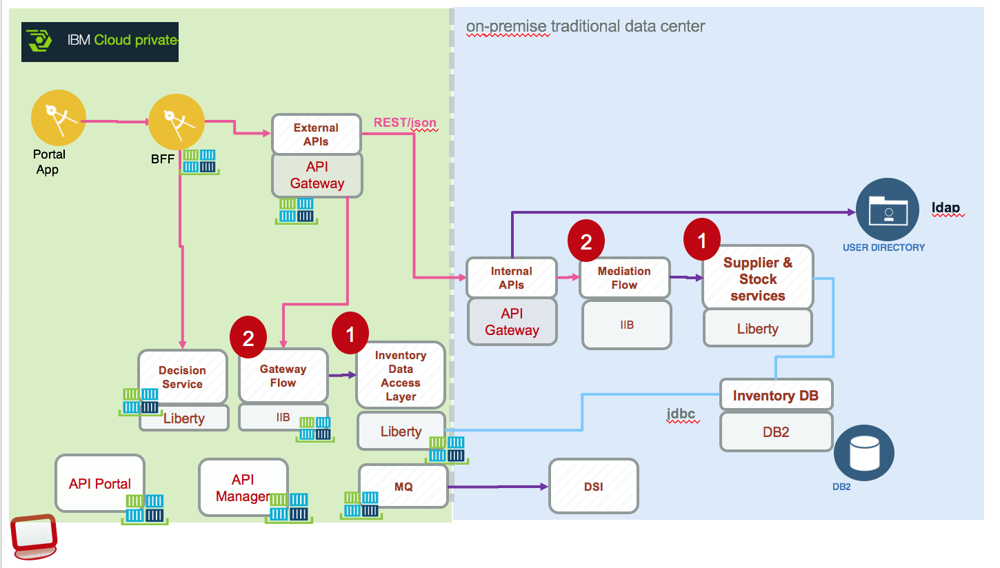

The source of the SOAP service is the same Java App deployed on premise or as pod on kubernetes. (Item 1 in figure above).

## Step by step tutorial
This section addresses how the SOAP to REST mediation flow was created. We develop a REST API and integration solution using IBM Integration Toolkit ([See product documentation](https://www.ibm.com/support/knowledgecenter/en/SSMKHH_10.0.0/com.ibm.etools.mft.doc/bi12036_.htm) and this [developer article for generic development tasks](https://developer.ibm.com/integration/docs/ibm-integration-bus/get-started-developing-an-integration-solution-overview/)) following the steps below:
### 1- Select the implementation style
We start by using a REST api integration style, so focusing on the consumer contract using RESTful web services. The REST API describes a set of resources, and a set of operations that can be called on those resources. External applications can call the operations in a REST API from any HTTP client. The mediation flows integrate with existing SOAP web services to do interface mapping. So the style is also integration service. The figure below illustrates the applications we are developing

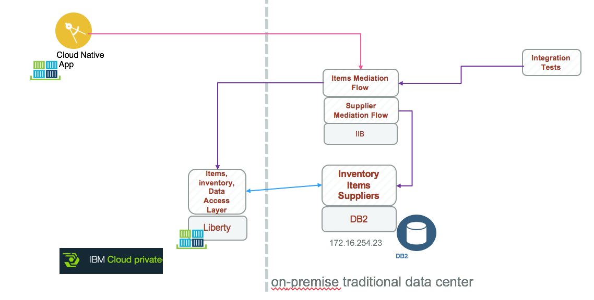

* A mediation flow to expose REST api for items and Inventory
* A mediation flow to do database integration and expose REST api for suppliers.

Start the Integration toolkit with the command `iib toolkit`.
1. Decide on reusable content that will be part of the Library. We like reuse. Payload definition like item, inventory, supplier definitions are reusable. So we create a "Shared Library" and copy the wsdl and xsd files into it. The Library can be imported in the Toolkit workspace from the integration/InventoryLibrary project. Shared libraries are deployed once in the runtime environment and shared by applications.
1. Create a REST API application using the Integration toolkit product: `Create a REST api`:

 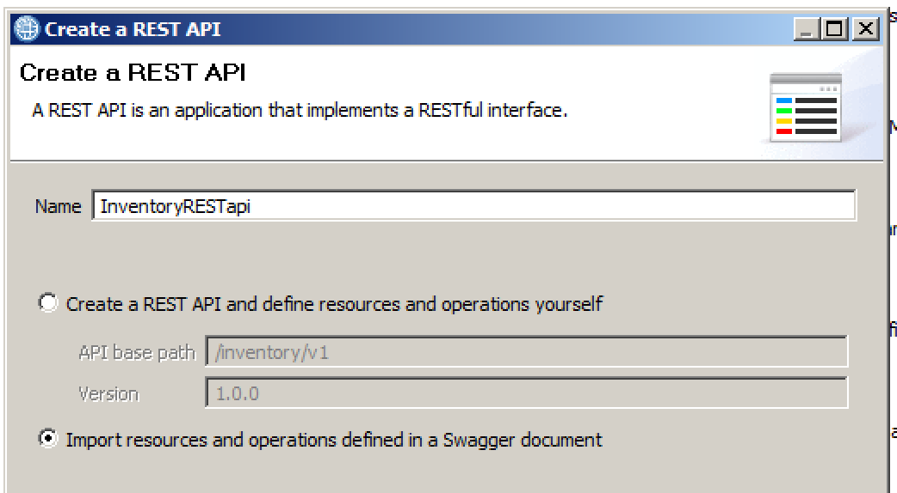

 Select the swagger from the library:
 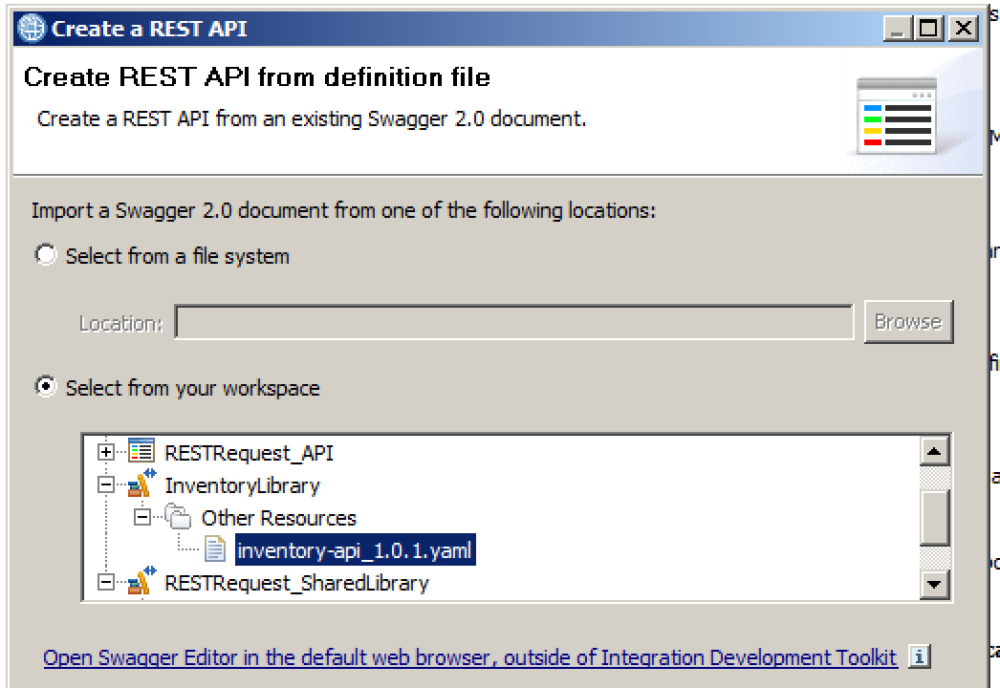

 The expected result looks like the figure below.
 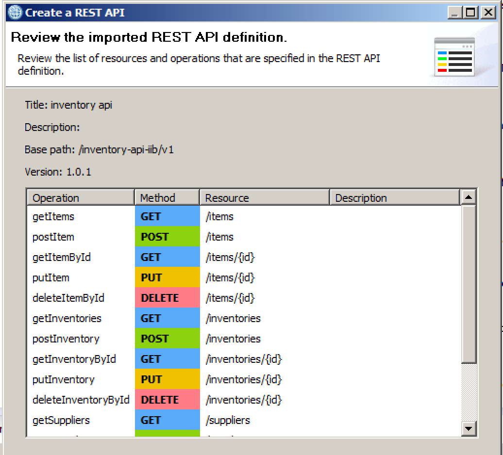

### 2- Define resource for integration solution
Define the resources and operations that will be exposed by the API using a swagger file. (We are reusing the swagger file defined in  integration/InventoryRESTapi/inventory-api_1.0.1.yaml file).

You can edit the file using a Swagger editor online at https://editor.swagger.io/.  
 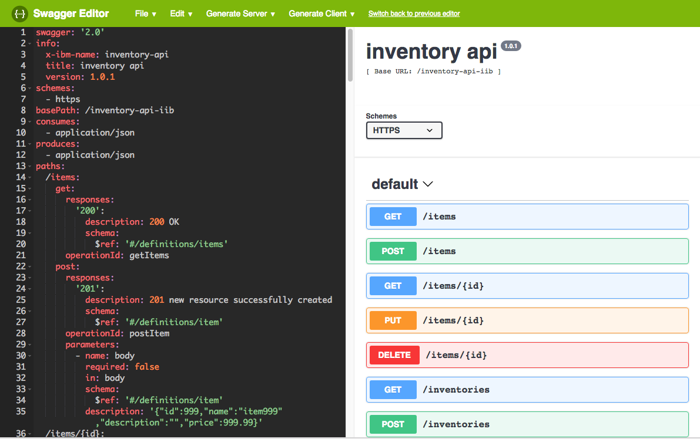

When designing REST API we used the following practices:
* Use plural noun and no verb for the resource URL
* Use PUT to alter state of an entity, and POST to create new entity
* Use sub-resources for relations like a supplier of an item
* Use query as part of the URL to filter entities, and paging
* API Version in the API
* PUT is idempotent http verb: calling it once should have the same effect as calling it multiple times. So use {id} parameter as part of the URL, to avoid potential issue on intermediate nodes in the path between the client and server, and it has to have the sane resource as the GET it comes from.
* Handle error with [HTTP status code](https://httpstatuses.com/). Below is the most used ones:
   * 200 – OK – Everything is working
   * 201 – OK – New resource has been created
   * 204 – OK – The resource was successfully deleted
   * 304 – Not Modified – The client can use cached data
   * 400 – Bad Request – Use error Payload
   * 401 – Unauthorized
   * 403 – Forbidden – The server understood the request, but is refusing it or the access is not allowed.
   * 404 – Not found – There is no resource behind the URI.
   * 422 – Non processable Entity – Should be used if the server cannot process the entity, e.g. if an image cannot be formatted or mandatory fields are missing in the payload.
   * 500 – Internal Server Error

* Define the data model (e.g. item and items objects were defined in the swagger file too). We have two message flow models to consider: the item on the REST api side, which is defined in the swagger:

and the SOAP envelop content defined by the imported XSD and shared in the Library:   
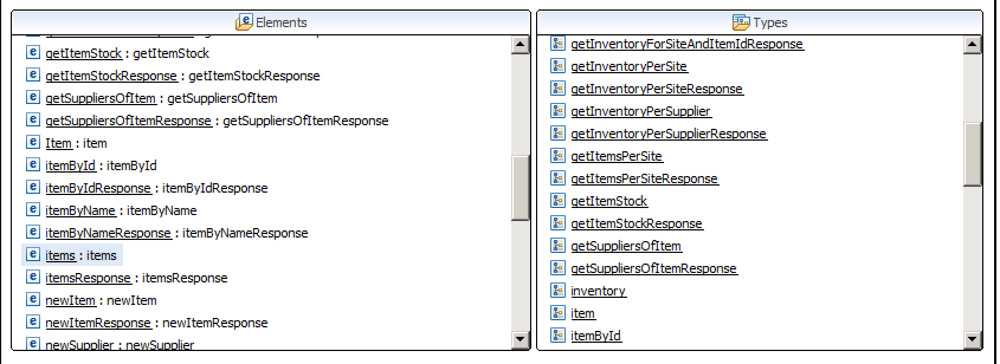

The inventory mediation flow will do the mapping between JSON and XML for items and inventory.

* We are delivering the WSDL in the Library. But you could have import the Data Access Layer WSDL using the Web Services Explorer (Import > Web services > Web Service), in the Web Services Explorer view, point to the URL of the ICP deployed component: (http://dal.brown.case/inventory/ws?wsdl) or the standalone Liberty Server (http://172.16.249.79:9080/inventory/ws?wsdl) and then import the wsdl into your integration/InventoryLibrary.  
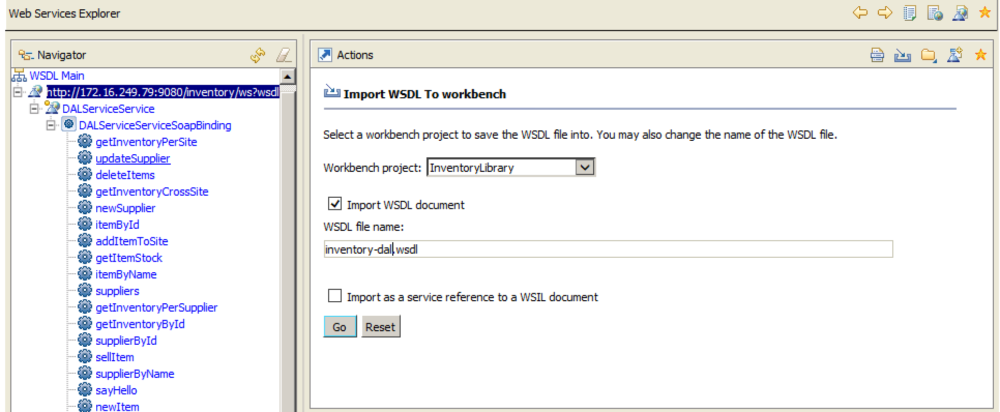  

### 3- Implement subflows for each operation end point
If you want to access the final solution, open the IIB toolkit and use import > General > Import existing project, then select the `refarch-integration-esb/integration/InventoryRESTapis` project.
The approach is to create a subflow for each operation of the wsdl and swagger URL.
1. We are demonstrating for the for getItems `/items` resource: select the `open the subflow for this operation` button on top right side of the operation:  
 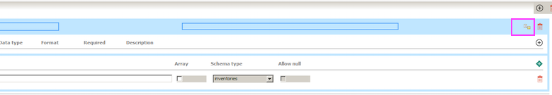

 The tool automatically generates input and output nodes and a subflow named: getitems.subflow.
 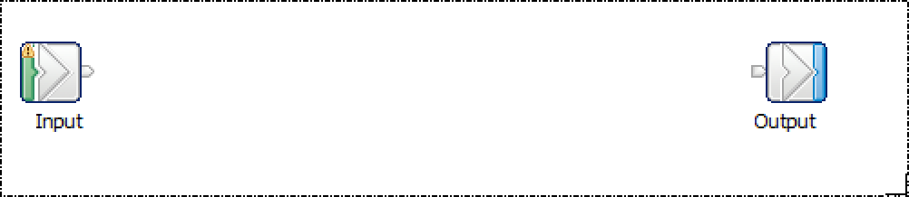   

  We need to add the SOAP call to the remote web service, by drag and drop the dal-inventory.wsdl to the map: it opens a wizard to help us selecting the operation (getItems) to invoke.   

 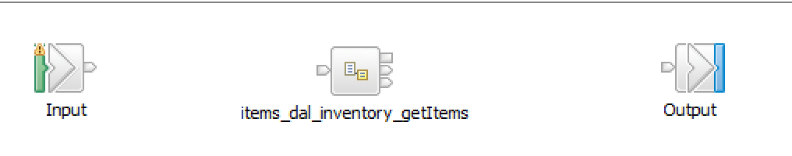

 The `items_dal_inventory_getItems` node is a map to call the SOAP service via a `Request` node and process the response. The flow is created automatically by the wizard, and includes fault reporting and payload extraction:

   

The request node is doing the HTTP call to the DALService `getItems` binding operation.  
 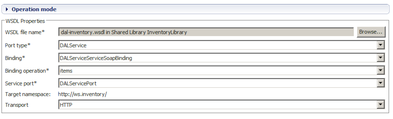

 We need to add the mappings from string to XML and XML to JSON.
  

 For the input mapping, there is not so much to do, as the `/items` resource has no parameter:
 * Add a Transformation map to the message flow, name it `mapRequest`.
 * connect to the Input element to the mapRequest, double click on mapRequest to enter in the `Map Editor`:
 * Add inputs as BLOB message model
 * Add an output object and use the `getItems` operation from the WSDL:  
  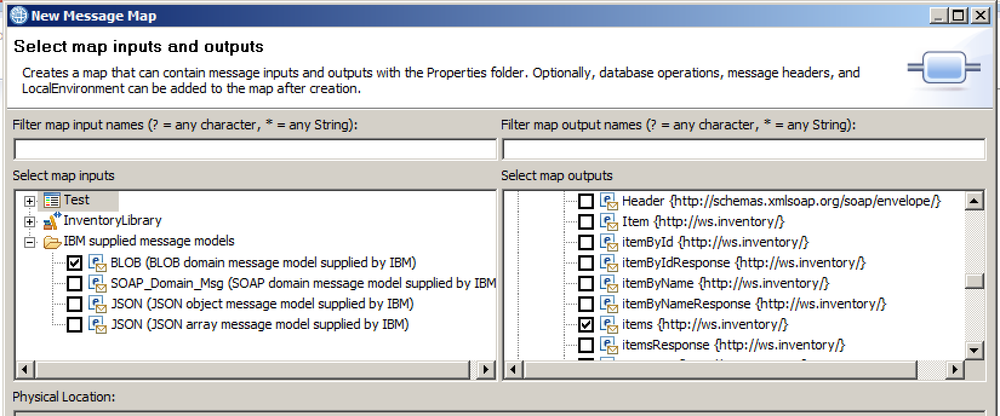  

To transform the XML items response to JSON array do the following:
* Add a transformation mapping
* Connect the output of the `getItems` call to the mapResponse and the output of the mapResponse to the Output of the subflow.

* Specify the itemsResponse and the JSON items
 
* Add `HTTPReplyHeader` property inside the assemble element, by using the `General tab` in the Message Assembly view and then the `Header and folders` properties link:

 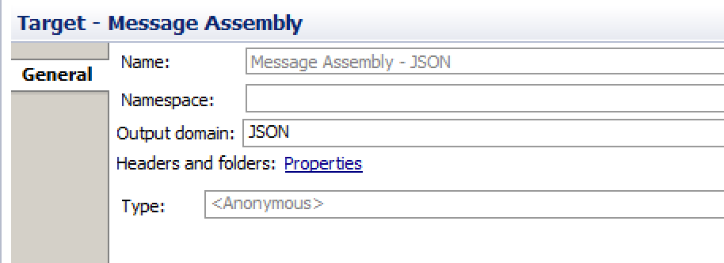
* Add Content-type variable and then Assign the 'Content-type' to application/json
 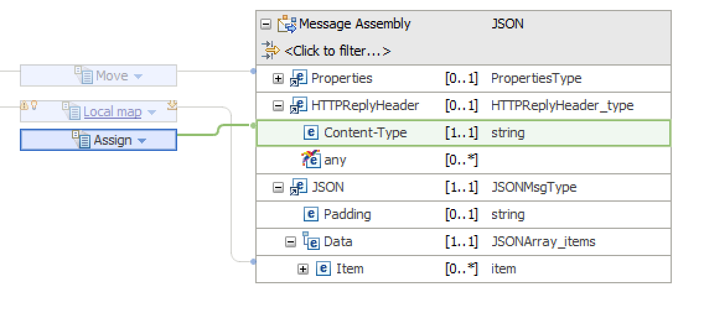

* For each items of the itemsResponse do a mapping to the Data JSON array items. Clicking on the `For Each` transform you can see the map below.
 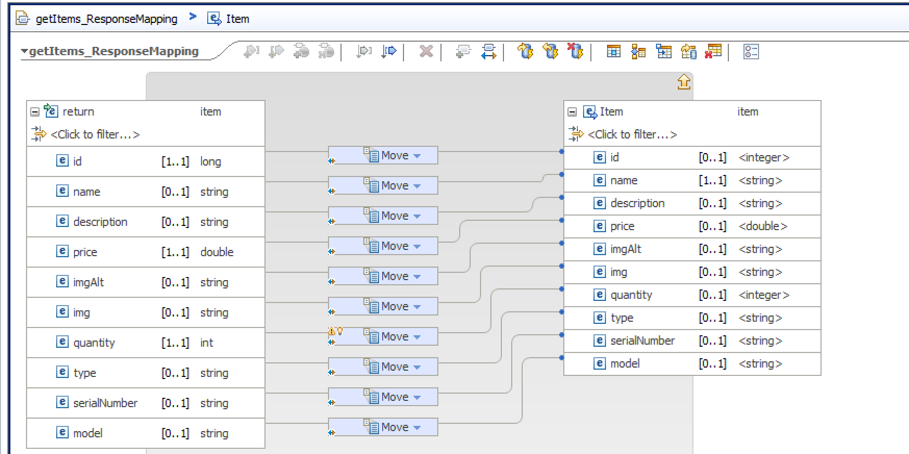

 Be sure to use convert transform for numerical fields.

(see [this note about REST Api implementation with message map in knowledge center ](https://www.ibm.com/support/knowledgecenter/SSMKHH_10.0.0/com.ibm.etools.mft.doc/sm12030_.htm))

### Deploy and test
First deploy the InventoryLibrary and then the InventoryRESTapis application into the default TestNode. Using the Deploy menu on each project in the Toolkit.

To test

You can have a look to the product [documentation](https://www.ibm.com/support/knowledgecenter/en/SSMKHH_10.0.0/com.ibm.etools.mft.doc/aa40160_.htm)

### Get by id

As illustrated in the figure below, the `/items/{id}` path get the `id` string as input and return a item object:
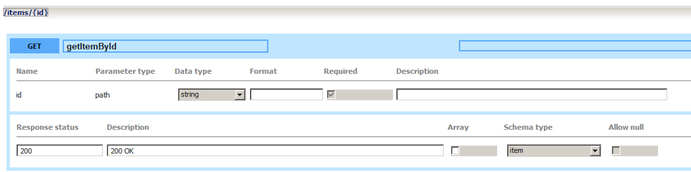

* open the message flow editor, drag and drop the wsdl and select the getItemById operation.
* Add map request mapping. The input message assebley is a BLOB, within which you need to add the local environment property, to access the REST parameter:
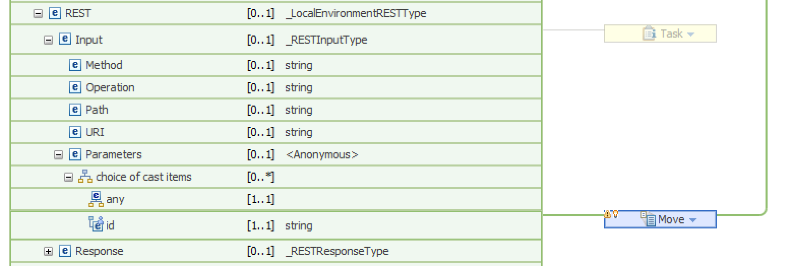  
Use Add element contextual menu to add the id parameter. Add a move transform.
The input string is mapped to the `itemId` of the soap request, the call to the Data Access Layer SOAP service is done inside the `items_ws` node, and the response is mapped back to json item array in the `mapResponse` node.

The `mapResponse` node is doing the data mapping to `json item` array:

The same logic / implementation pattern is done for the other flows supporting each REST operations. All the flows are defined in the integration/RESTAPI folder.

| Operation | Flow name | Map |
| --------- | -------- | ----- |
| get item  | getId.subflow | getId_mapRequest, getId_mapResponse |
| put item  | putId.subflow | putId_mapRequest, putId_mapResponse |
| delete item  | deleteId.subflow | deleteId_mapRequest, deleteId_mapResponse |
| get items | getItems.subflow | getItems_mapRequest, getItems_mapResponse |
| post items | postItems.subflow | postItems_mapRequest, postItems_mapResponse |

## Other readings
* Protocol and data mapping, via the implementation of flows. ([See product documentation](https://www.ibm.com/support/knowledgecenter/en/SSMKHH_10.0.0/com.ibm.etools.mft.doc/bi12020_.htm)).  
